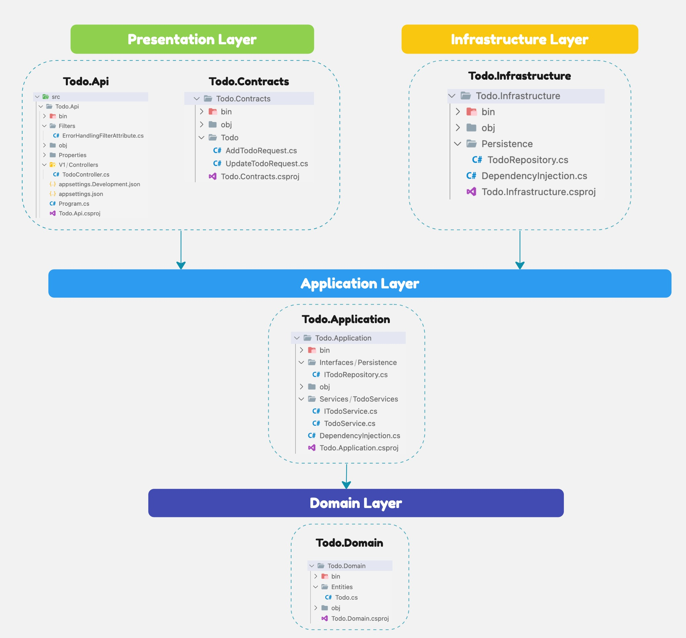
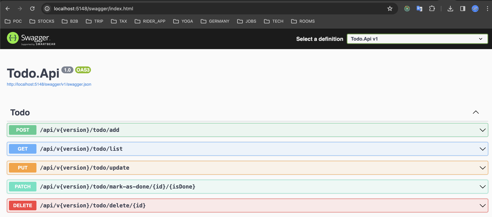

# TODO API SERVICE (Version 1.0)

Robust ASP.NET Core Web API Service for CRUD Operations with Clean Architecture and Unit Testing.

## Table of Contents

- [Getting Started](#getting-started)
  - [Installation](#installation)
  - [Packages](#packages)
  - [Running the Application](#running-the-application)
- [API Documentation](#api-documentation)
- [Folder Structure](#folder-structure)

## Getting Started

Todo Api is using ASP.NET Core Web API (.net8). This service will allow basic operations like Add, Get all, Update, Mark as done, delete the task.

### Installation

#### Clone the repository:

Open your terminal or command prompt, go to the desired directory, and use the following command to clone the .NET Core Web API project:

```
git clone https://github.com/maheshpeechamkoli/vp-todo-api-services.git
cd vp-todo-api-services
```

### Running the Application using Docker

Make sure your docker is up and runing.

```
docker-compose build (Docker Compose V1)
docker compose build (Docker Compose V2)

docker compose up
```

Open the swagger URL

```
http://localhost:5148/swagger/index.html
```

Or

```
 . Install RESTClient VSCode extension
 . request/Todo.Api.http
```

### Running the Application with the .NET CLI

1. Downlaod .NET Core SDK for Windows

```
https://dotnet.microsoft.com/download
```

2. .NET Core SDK CLI for Mac

```
brew install --cask dotnet-sdk
```

##### Navigate to root directory

```
dotnet build
```

Run your .NET Core Web API using the following command:

```
cd .\src\Todo.Api\
```

```
dotnet run
```

or

```
dotnet watch run
```

Run your .NET Core Test project using the following command:

```
cd .\tests\Todo.Api.Tests\

or

cd .\tests\Todo.Application.Tests\

or

cd .\tests\Todo.Infrasructure.Tests\

```

```
dotnet test
```

### Packages

#### Project - version details

    1. net8.0
    2. Swashbuckle.AspNetCore 6.4.0
    3. AspNetCore.OpenApi 8.0.0
    4. AspNetCore.Mvc.Versioning 5.1.0

#### Unit Test - version details

    1. NET.Test.Sdk 17.6.0
    2. xunit 2.4.2
    3. xunit.runner.visualstudio 2.4.5
    4. AutoFixture 4.18.1
    5. FluentAssertions 6.12.0
    6. Moq 4.20.70

## API Documentation

### Crete API

#### Request Body

```
POST  {{host}}/todo/add
Content-Type: application/json

{
  "task": "Addsdfzsdsddd",
  "deadline": "2024-02-25T09:42:31.580Z"
}
```

#### Response Body

```
Status Code : 201
```

### List API

#### Request Body

```
GET  {{host}}/todo/list
Content-Type: application/json
```

#### Response Body

Status Code : 200

```

[
  {
    "id": "0d1e9afb-24cc-4a91-8e12-8766571360db",
    "task": "Add Booking",
    "deadline": "2024-02-25T09:42:31.58Z",
    "isDone": false
  },
  {
    "id": "f3a29b0e-a97f-4d7b-a374-5c4faa45c927",
    "task": "Take Medicine",
    "deadline": "2024-02-25T09:42:31.58Z",
    "isDone": false
  }
]
```

### Update API

#### Request Body

```
PUT  {{host}}/todo/update
Content-Type: application/json
```

```
{
  "id": "8c2cd205-12e4-4456-9560-dc1d0e33d8a7",
  "task":"New Update added",
  "deadline": "2025-03-23",
  "isdone": true
}
```

#### Response Body

```
{
  "message": "Task updated successfully."
}
```

### Mark Done API

#### Request Body

```
DELETE  {{host}}/todo/mark-as-done/{id}/{isDone}
Content-Type: application/json
```

#### Response Body

```
{
  "message": "Task marked as done."
}
```

### Delete API

#### Request Body

```
DELETE  {{host}}/todo/delete/{id}
Content-Type: application/json
```

#### Response Body

```
{
  "message": "Task deleted successfully."
}
```

## Folder Structure

### --src



## OutPut



### Thank you
